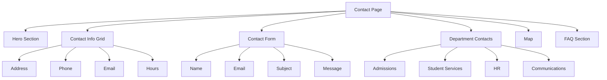

# Contact Us Page & Navbar Enhancement Plan

## Overview
Create a full-featured Contact Us page and add "Contact" link to the navbar across all pages.

---

## 1. Contact Us Page Structure (`contact.html`)

### Hero Section
- Page title: "Get in Touch"
- Subtitle: "We're here to help - reach out to us"
- Background: Gradient consistent with other pages

### Contact Information Section
- **District Office**
  - Address: 1111 West 6th Street, Austin, TX 78703
  - Phone: (512) 414-1700
  - Email: info@austinisd.org
  - Office Hours: Monday-Friday, 8:00 AM - 5:00 PM

### Contact Form Section
- Name (first/last)
- Email address
- Phone number
- Subject (dropdown: General Inquiry, Admissions, Academics, Careers, Other)
- Message
- Preferred contact method (email/phone)
- Submit button with hover effects

### Department Contacts Section
Cards for each department:
- Admissions Office
- Student Services
- Human Resources
- Communications
- Technology Support

### Map Section
- Embedded Google Map showing district location
- Directions link

### FAQ Section
Common questions with expandable answers:
- How do I enroll my child?
- What documents do I need for registration?
- How do I transfer schools within the district?
- Who do I contact for special education services?
- How can I apply for a job?

---

## 2. Navbar Updates

Add "Contact" link to the navigation on all pages:
- [index.html](index.html)
- [about.html](about.html)
- [schools.html](schools.html)
- [enrollment.html](enrollment.html)
- [academics.html](academics.html)
- [careers.html](careers.html)
- [news-events.html](news-events.html)

Placement: After "Careers" link, before "Enroll Now" button

---

## 3. CSS Styles to Add

### New Components
- `.contact-hero` - Hero section styling
- `.contact-grid` - Two-column layout for info + form
- `.contact-info-card` - Individual contact info cards
- `.contact-form` - Form styling with inputs and validation states
- `.department-card` - Department contact cards
- `.faq-item` - FAQ accordion styling
- `.map-container` - Map embed styling

### Existing Components to Reuse
- `.hero` - Hero section base
- `.glass-effect` - Card backgrounds
- `.btn-primary`, `.btn-secondary` - Buttons
- `.section-badge` - Section labels
- `.animate-on-scroll` - Scroll animations

---

## 4. Implementation Order

1. Create `contact.html` with full content
2. Add CSS styles for new components
3. Update navbar in index.html
4. Update navbar in about.html
5. Update navbar in schools.html
6. Update navbar in enrollment.html
7. Update navbar in academics.html
8. Update navbar in careers.html
9. Update navbar in news-events.html
10. Test responsive behavior

---

## 5. Visual Design

---

## Files to Create/Modify

### New Files
- `contact.html` - Main contact page
- `plans/contact-us-page-plan.md` - This plan

### Modified Files
- `css/styles.css` - Add new component styles
- `index.html` - Add Contact link to navbar
- `about.html` - Add Contact link to navbar
- `schools.html` - Add Contact link to navbar
- `enrollment.html` - Add Contact link to navbar
- `academics.html` - Add Contact link to navbar
- `careers.html` - Add Contact link to navbar
- `news-events.html` - Add Contact link to navbar

---

## Ready to Implement?

Would you like me to proceed with this plan, or would you like to make any changes?
